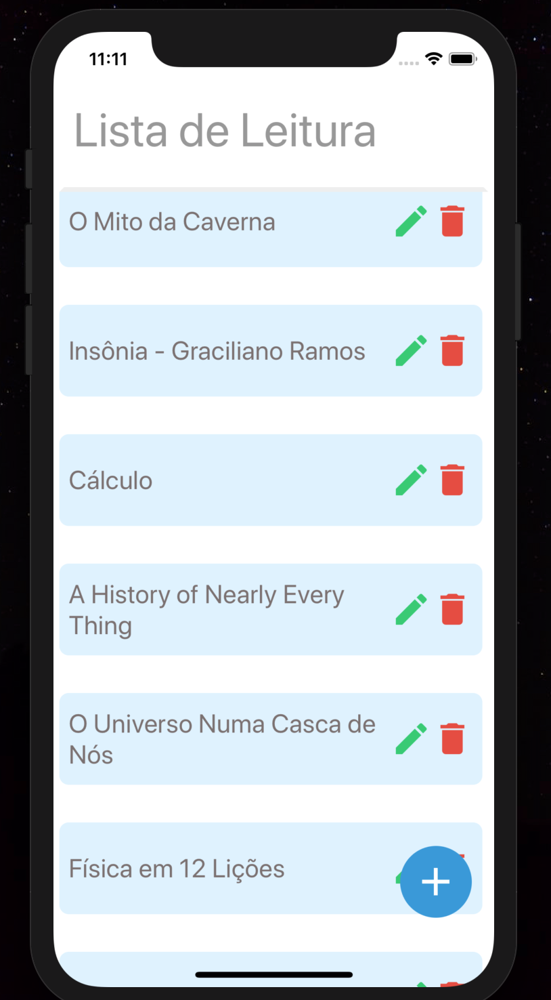
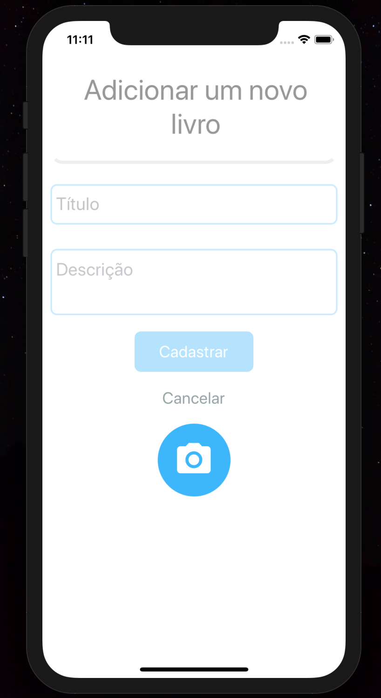
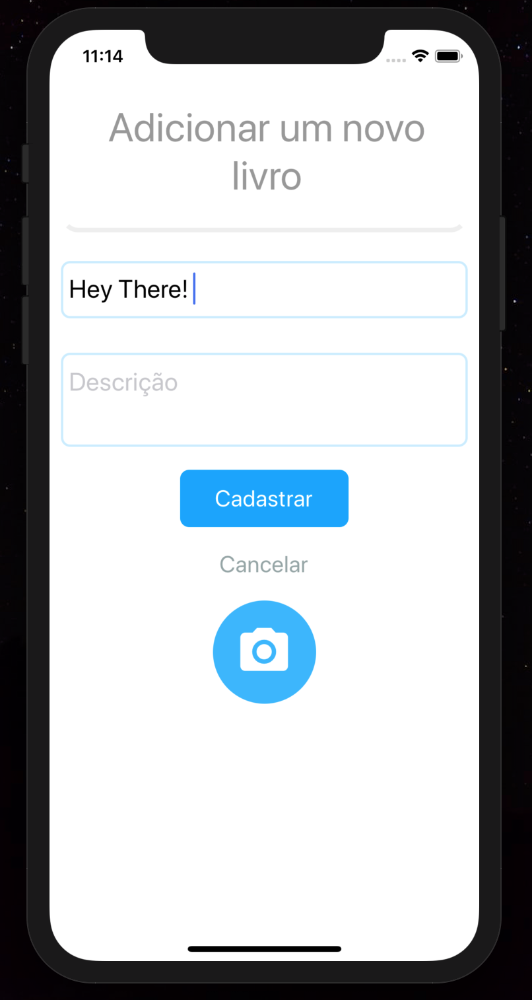
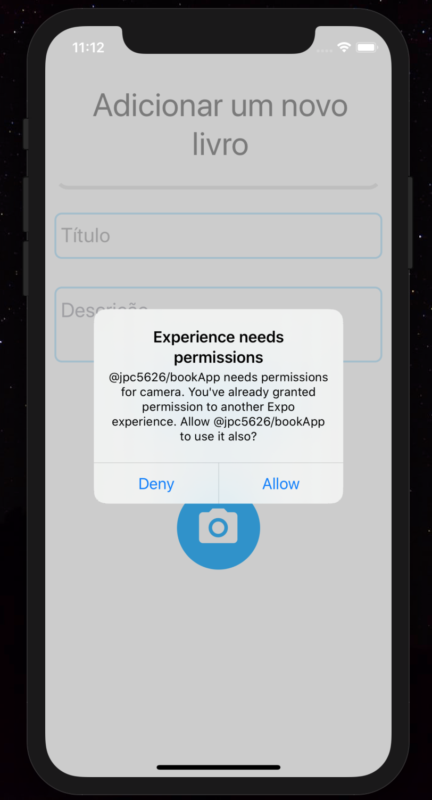
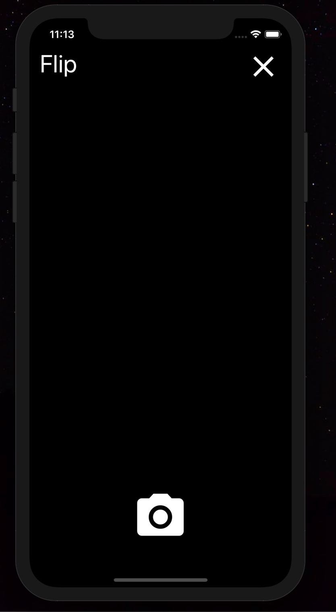

# Book List App 

	

    
 </a>

 

    
    
    
    
    
</>

## :information_source: Info

  A simple React Native App aimed to learn the principals of Props, States, FlatList and React Navigation in React Native. The aplication was eveloped in the online course "Meu Primeiro Aplicativo", (My First Application in english), conducted and designed by Felipe Fontoura from Dev Samurai.

## Design 🎨

    For designing and prototyping I used Figma 

Figma Design :

- [Figma](https://www.figma.com/file/FeJCre6gu5thO2NcV8gv4O/BookList?node-id=0%3A1)

## About 
* **Platform:** iOS & Android

* **Related Articles:** 
### [React Native Basics: Componentes Funcionais vs Classes](https://devsamurai.com.br/react-native-componentes-funcionais-vs-classes/)

### [React Native Basics: Props & States](https://devsamurai.com.br/react-native-basics-props-states/)

### [React Native Tuturials: Usando a Câmera do Celular](https://devsamurai.com.br/react-native-camera/)

### [JavaScript: Filter, Map e Reduce – O Guia Supremo](https://devsamurai.com.br/javascript-filter-map-reduce-guia-supremo/)

## 💻 Demonstration
### 📱Screens

    

## Development

## Pre-requisities
- [Node.js](https://nodejs.org/en/)
- [Git](https://git-scm.com)

### Expo 
[Expo](https://expo.io) is a framework and a platform for universal React applications. It is a set of tools and services built around React Native and native platforms that help you develop, build, deploy, and quickly iterate on iOS, Android, and web apps from the same JavaScript/TypeScript codebase.

### This Project in Expo :
[Will be able to view the project here](https://expo.io/@jpc5626/bookApp)

# Quick start

## Install the command line tools

` $ npm install --g expo-cli `

## Clone this repository
` $ git clone https://github.com/5626pedro/insta-cat-app `

## Go into the repository
` $ cd insta-cat-app `

## Start the local development server of Expo CLI

`$ expo start`

# iOS Simulator
Step 1: Install Xcode

Step 2: Install Xcode Command Line Tools

Step 3: "Run on iOS simulator" from the browser-based DevTools UI

[Official Guide](https://docs.expo.io/workflow/ios-simulator/)

# Android Studio Emulator

Step 1: Set up Android Studio's tools

Step 2: Set up a virtual device

Step 3: "Run on Android device/emulator" from the browser-based DevTools UI

[Official Guide](https://docs.expo.io/workflow/android-studio-emulator/)
